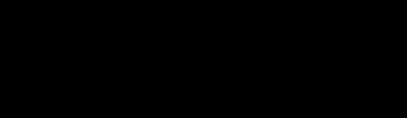
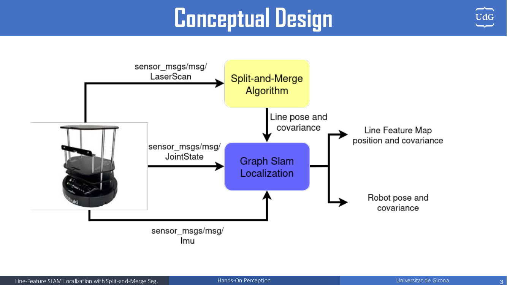
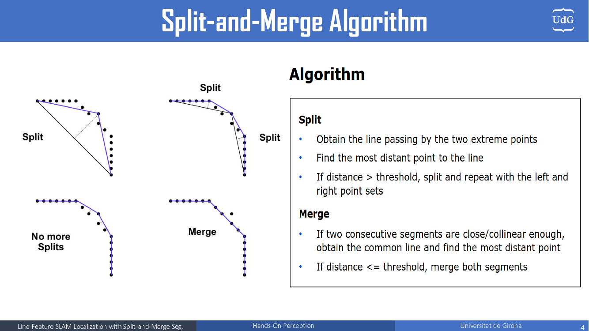
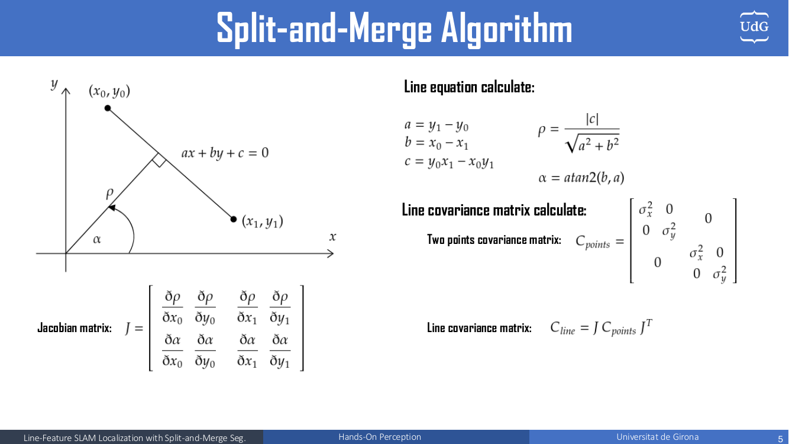
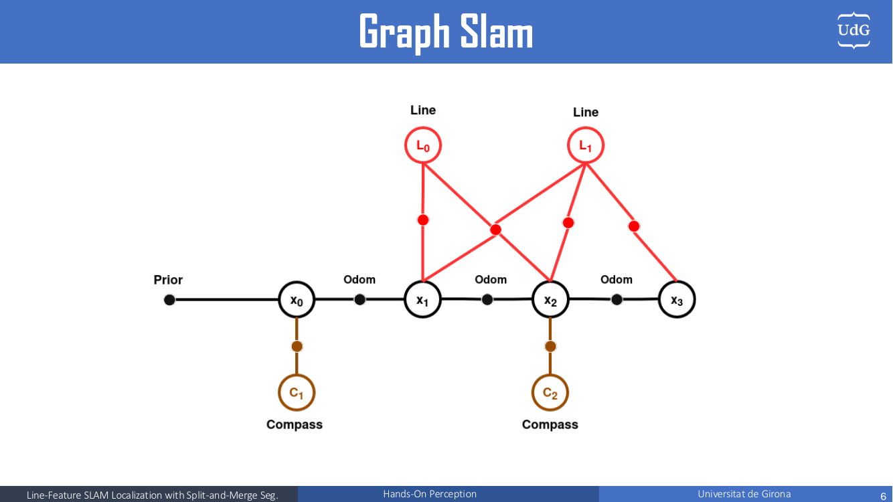
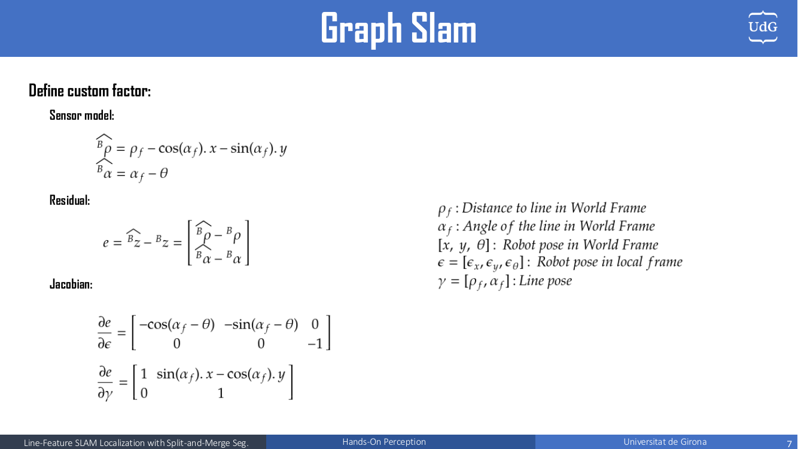
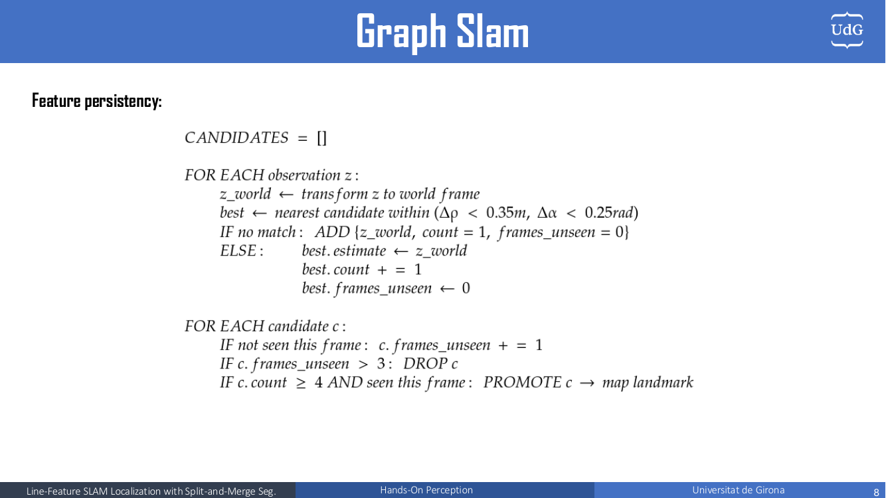
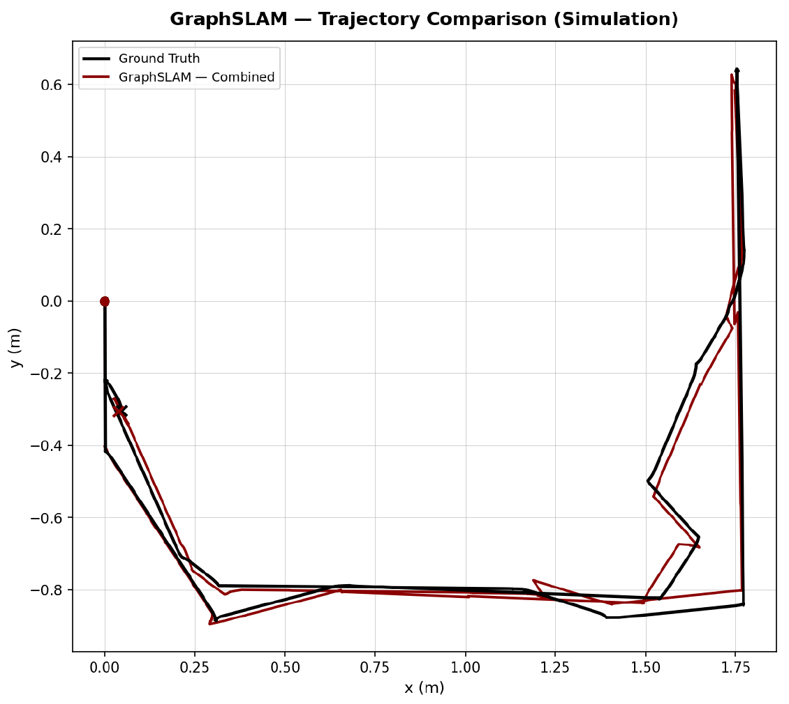
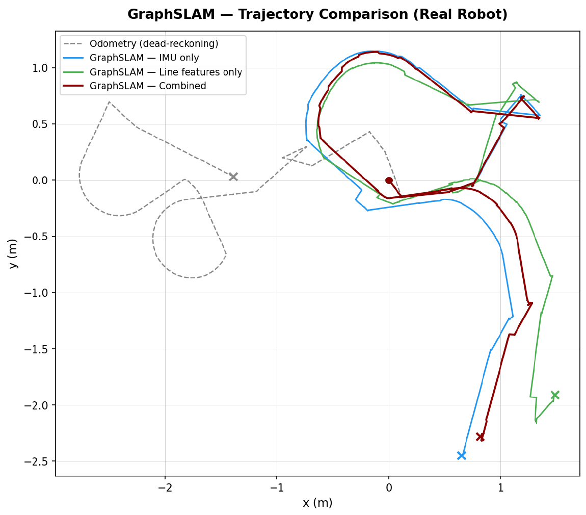
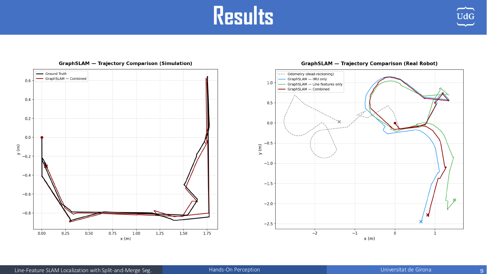

# Line-Feature Graph SLAM Localization with Split-and-Merge Segmentation

**Hands-On Localization — Universitat de Girona (IFRoS)**

A ROS 2 localization system for the Kobuki TurtleBot. The robot extracts **line features** (walls) from its 2D LiDAR scans with the **Split-and-Merge** algorithm, then fuses them with **wheel odometry** and an **IMU compass** in a **factor graph** optimized incrementally with **GTSAM iSAM2**. It estimates the robot pose and builds a map of line landmarks, each with its uncertainty. It runs in real time on both the Stonefish simulator and the real robot.

<p align="center">
  
  <br>
  <em>Real robot run (4× speed). Left: the TurtleBot in the maze. Right: RViz with mapped line landmarks (cyan), their 95% uncertainty bounds (yellow), and current scan-to-map associations (white, labelled with ρ/α).</em>
</p>

---

## Table of contents

1. [System overview](#1-system-overview)
2. [Line extraction: Split-and-Merge](#2-line-extraction-split-and-merge)
3. [Graph SLAM back-end](#3-graph-slam-back-end)
4. [Data association and feature persistency](#4-data-association-and-feature-persistency)
5. [Results](#5-results)
6. [Repository layout](#6-repository-layout)
7. [Installation and build](#7-installation-and-build)
8. [Running](#8-running)
9. [ROS interface](#9-ros-interface)
10. [Tunable parameters](#10-tunable-parameters)
11. [Plotting trajectories](#11-plotting-trajectories)
12. [Conclusion and future work](#12-conclusion-and-future-work)
13. [Authors](#13-authors)

---

## 1. System overview

<p align="center"></p>

The pipeline has three inputs and two outputs:

| Input | Message | Used for |
|---|---|---|
| LiDAR | `sensor_msgs/LaserScan` | Split-and-Merge → line observations `(ρ, α)` + covariance |
| Wheel encoders | `sensor_msgs/JointState` | Differential-drive motion model (prediction + odometry factors) |
| IMU | `sensor_msgs/Imu` | Absolute yaw ("compass") factor |

| Output | Description |
|---|---|
| Robot pose + covariance | Published as `nav_msgs/Odometry` and on TF |
| Line-feature map | Landmarks `(ρ_f, α_f)` in the world frame, each with a 2×2 covariance, visualized in RViz |

Each time a joint-state message arrives, the node in [perform_localization.py](localization_graph_slam/localization_graph_slam/perform_localization.py):

1. **Syncs** the newest IMU and LiDAR measurements that are within a time threshold of the encoder timestamp.
2. **Predicts** the pose with the differential-drive model and accumulates the relative motion since the last key-frame.
3. **Associates** the observed lines with map landmarks (ICNN + Mahalanobis gating).
4. When the robot has moved enough (translation, rotation, or elapsed time), it **adds a key-frame** to the factor graph and runs an **iSAM2 update**.
5. **Promotes** lines that have been seen consistently into new map landmarks.
6. **Publishes** the odometry, TF, and RViz markers.

---

## 2. Line extraction: Split-and-Merge

<p align="center"></p>

Implemented in [line_extraction.py](localization_graph_slam/localization_graph_slam/line_extraction.py) (`SplitAndMerge` class).

**Split** (recursive):
- Fit a line through the first and last points of the set.
- Find the point farthest from that line.
- If its distance is above `line_split_distance_threshold`, split the set at that point and recurse on both halves. Otherwise, keep the segment.
- Sets with `line_min_points` points or fewer are discarded.

**Merge** (iterative):
- Two segments are merged if their normal distances differ by less than `line_merge_distance_threshold` and their normal angles differ by less than `line_merge_angle_deg`.
- The merged segment spans the extreme endpoints projected on the dominant direction.
- The pass repeats until nothing changes.

Segments shorter than `line_min_length` are dropped before they reach the SLAM back-end.

### Line parameters and covariance

<p align="center"></p>

Each segment through the endpoints $(x_0, y_0)$ and $(x_1, y_1)$ is converted to Hessian normal form $ax + by + c = 0$:

$$
a = y_1 - y_0,\qquad b = x_0 - x_1,\qquad c = y_0x_1 - x_0y_1
$$

$$
\rho = \frac{|c|}{\sqrt{a^2 + b^2}},\qquad \alpha = \operatorname{atan2}(b, a)
$$

The endpoint noise $C_{points} = \operatorname{diag}(\sigma_x^2, \sigma_y^2, \sigma_x^2, \sigma_y^2)$ (with $\sigma$ = `line_measurement_sigma_r`) is propagated to the line with the 2×4 Jacobian $J = \partial(\rho, \alpha) / \partial(x_0, y_0, x_1, y_1)$:

$$
C_{line} = J\, C_{points}\, J^T
$$

---

## 3. Graph SLAM back-end

<p align="center"></p>

The factor graph (GTSAM, symbols `X_i` for poses and `L_j` for lines) contains:

| Factor | GTSAM type | Connects | Noise |
|---|---|---|---|
| Prior | `PriorFactorPose2` | `X_0` | σ = 1e-7 (anchors the origin) |
| Odometry | `BetweenFactorPose2` | `X_{i-1}` → `X_i` | Relative covariance propagated from encoder noise |
| Compass | `PoseRotationPrior2D` | `X_i` | `imu_sigma` |
| Line prior | `PriorFactorPoint2` | `L_j` | Weak: σ = (0.5 m, 20°), added once, when the landmark is created |
| Line observation | `CustomFactor` | `X_i` ↔ `L_j` | Line covariance from Split-and-Merge |

### Motion model

The encoder wheel velocities $(\omega_L, \omega_R)$ give

$$
v = \tfrac{r}{2}(\omega_L + \omega_R),\qquad \omega = \tfrac{r}{B}(\omega_R - \omega_L)
$$

with wheel radius $r$ = `radius_wheel` and wheelbase $B$ = `base_length`. Between key-frames, the relative displacement and its covariance $\Sigma_{rel} \leftarrow J_x \Sigma_{rel} J_x^T + J_w Q_{enc} J_w^T$ are accumulated and become one odometry factor.

### Custom line factor

<p align="center"></p>

The sensor model predicts how a world-frame line $(\rho_f, \alpha_f)$ appears from the robot pose $(x, y, \theta)$:

$$
{}^B\hat\rho = \rho_f - \cos(\alpha_f)\,x - \sin(\alpha_f)\,y,\qquad {}^B\hat\alpha = \alpha_f - \theta
$$

The residual is $e = {}^B\hat z - {}^B z$, with the angle wrapped to $[-\pi, \pi]$. Its analytic Jacobians with respect to the pose (in the local frame, as GTSAM expects) and to the landmark are:

$$
\frac{\partial e}{\partial \epsilon} =
\begin{bmatrix} -\cos(\alpha_f - \theta) & -\sin(\alpha_f - \theta) & 0 \\ 0 & 0 & -1 \end{bmatrix},\qquad
\frac{\partial e}{\partial \gamma} =
\begin{bmatrix} 1 & \sin(\alpha_f)\,x - \cos(\alpha_f)\,y \\ 0 & 1 \end{bmatrix}
$$

See `LineFeatureError` in [perform_localization.py](localization_graph_slam/localization_graph_slam/perform_localization.py).

### Optimization

- The first optimization is a batch **Levenberg–Marquardt** solve, used to initialize iSAM2.
- After that, new factors are pushed to **iSAM2** every `key_frame_update` key-frames that carry an IMU or line measurement.
- After each update, `gtsam.Marginals` gives the joint covariance of the current pose and all landmarks. The pose covariance is rotated from the body frame into the world frame, and each landmark's 2×2 block is stored for data association and for drawing the uncertainty bounds.

---

## 4. Data association and feature persistency

### Data association ([data_association.py](localization_graph_slam/localization_graph_slam/data_association.py))

1. Every map landmark is projected into the robot frame with $h_f(x_k)$. Its predicted covariance is $P_F = J_x P_k J_x^T + J_f P_{map} J_f^T$.
2. For every observation–landmark pair, the squared Mahalanobis distance is computed, and the pair is gated by a χ² test (2 DOF, confidence `da_confidence_level`).
3. **ICNN** assignment: compatible pairs are sorted by distance and assigned greedily, one-to-one.
4. An observation that is still unassociated is transformed to the world frame and checked against the map with a tight geometric gate (`da_duplicate_*`). This catches duplicates that the statistical test missed.

Associated observations become line factors. When an associated scan reaches past a landmark's drawn endpoints, the segment used for visualization is extended.

### Feature persistency ([feature_candidate_tracker.py](localization_graph_slam/localization_graph_slam/feature_candidate_tracker.py))

<p align="center"></p>

Unassociated lines do not enter the map right away. They go into a **candidate pool**:

- Each observation is matched to the nearest candidate in the world frame (gates `feature_candidate_match_rho` / `feature_candidate_match_alpha`). If none matches, a new candidate is created with `count = 1`.
- On a re-observation, the candidate's estimate is **replaced** with the latest sighting instead of averaged. Sightings from different drifting poses are correlated, so averaging them would be over-confident. Combining them properly is left to iSAM2.
- A candidate unseen for more than `feature_candidate_max_unseen_frames` key-frames is dropped.
- A candidate seen at least `feature_min_observations` times, and seen in the current frame, is **promoted** to a map landmark `L_j` and added to the graph.

This filters out spurious lines (people, clutter, bad segmentation) and noticeably reduces duplicate landmarks.

> The numbers on the slide (0.35 m / 0.25 rad / 3 frames / 4 observations) are from an earlier tuning. The current code defaults are listed in [Tunable parameters](#10-tunable-parameters).

---

## 5. Results

### Real robot

<p align="center"></p>

The full-resolution video (1920×1080, ~79 s) is at `Result/Video/Result.mp4`.

### Trajectory comparison

<table>
<tr>
<td align="center" width="50%"><br><b>Simulation</b></td>
<td align="center" width="50%"><br><b>Real robot</b></td>
</tr>
</table>

- **Simulation:** the combined GraphSLAM estimate (dark red) follows the ground truth (black) closely along the whole circuit, and the end point closely matches the true final pose.
- **Real robot:** dead-reckoning odometry (grey, dashed) drifts badly and ends up in a completely different region. IMU-only (blue) fixes the heading but still drifts in position. Line-only (green) is locally consistent but gets jagged when few walls are visible. **Combining both** (dark red) gives the most consistent trajectory.

### Slides

The full presentation is at [`Result/Slide/localization-1.pdf`](Result/Slide/localization-1.pdf).

<details>
<summary>Show all slides</summary>

| | |
|---|---|
|  |  |
|  |  |
|  |  |
|  | |

</details>

---

## 6. Repository layout

This repository is the `src/` folder of a colcon workspace.

```
src/
├── localization_graph_slam/          ← this project
│   ├── localization_graph_slam/
│   │   ├── perform_localization.py   # GraphSlam node: prediction, iSAM2, TF, visualization
│   │   ├── line_extraction.py        # SplitAndMerge + standalone line_extraction node
│   │   ├── data_association.py       # ICNN, Mahalanobis gating, duplicate check
│   │   ├── feature_candidate_tracker.py  # Feature persistency (candidate pool)
│   │   ├── plot_trajectory.py        # Offline trajectory comparison plots
│   │   └── utils.py                  # Quaternion/Euler helpers, NED→ENU, angle wrap
│   ├── rviz/HOL_project.rviz         # RViz configuration
│   ├── setup.py / package.xml
├── turtlebot_simulation/             # Stonefish scenarios and launch files
├── stonefish_ros2/                   # Stonefish simulator ROS 2 bridge
├── turtlebot_description/ kobuki_description/ swiftpro_description/  # Robot models
├── turtlebot_rviz/ octomap_rviz_plugins/ scan_to_cloud2/             # Supporting packages
├── docs/                             # README media (GIF, plots, slide images)
└── Result/                           # Original slides (PDF) and video (MP4)
```

---

## 7. Installation and build

**Requirements**

- Ubuntu 24.04 with [ROS 2 Jazzy](https://docs.ros.org/en/jazzy/Installation.html), which uses the system Python 3.12
- [Miniconda](https://docs.conda.io/en/latest/miniconda.html) for the Python environment `IFROS_localization`
- Stonefish simulator (simulation only)

### 7.1 Create the conda environment

ROS 2 Jazzy runs on the **system** Python 3.12. The conda env `IFROS_localization` uses the same Python version and holds the extra libraries (GTSAM, SciPy, …). At runtime, its `site-packages` folder is added to `PYTHONPATH`, so the ROS nodes can import them.

Option A: from the provided [environment.yml](environment.yml):

```bash
conda env create -f environment.yml
```

Option B: manually:

```bash
conda create -n IFROS_localization python=3.12 -y
conda activate IFROS_localization
pip install gtsam==4.3a0 numpy==1.26.4 scipy matplotlib pyyaml \
            catkin_pkg empy==3.3.4 lark
```

> **Version notes**
>
> - Python **must be 3.12**, the same as ROS 2 Jazzy. Otherwise the compiled `rclpy` and `gtsam` modules cannot be mixed.
> - Keep **NumPy 1.x** (`1.26.4`). ROS 2 Jazzy packages such as `cv_bridge` and `tf2_py` are built against NumPy 1.x.
> - `empy` **must be 3.3.4**. `rosidl` fails to generate messages with empy 4.x.

Check the installation:

```bash
conda activate IFROS_localization
python -c "import gtsam, numpy, scipy; print('gtsam OK, numpy', numpy.__version__)"
```

### 7.2 Make the environment visible to ROS

Add these lines to your `~/.bashrc`:

```bash
source /opt/ros/jazzy/setup.bash
alias ifros-localization-env='export PYTHONPATH=$PYTHONPATH:$HOME/miniconda3/envs/IFROS_localization/lib/python3.12/site-packages'
```

Then, **in every new terminal** that builds or runs this project:

```bash
conda activate IFROS_localization
ifros-localization-env
```

> If Miniconda is not in `~/miniconda3`, adjust the path. You can find it with `conda info --base`.

### 7.3 Build the workspace

```bash
mkdir -p ~/project_ws && cd ~/project_ws
git clone https://github.com/Alex108306/src.git src

conda activate IFROS_localization
ifros-localization-env

colcon build --symlink-install
source install/setup.bash
```

Check that ROS can see GTSAM:

```bash
python3 -c "import rclpy, gtsam; print('ROS + GTSAM OK')"
```

---

## 8. Running

Every terminal needs the environment first:

```bash
conda activate IFROS_localization
ifros-localization-env
source ~/project_ws/install/setup.bash
```

The node has two modes, selected with the `mode` parameter:

| | `sim` (default) | `real` |
|---|---|---|
| World frame | `world_enu` | `map` |
| TF published | `world_enu → turtlebot/base_footprint` | `map → odom` correction (REP-105). Wheel odometry keeps owning `odom → base_footprint` |
| IMU topic | `/turtlebot/sensors/imu_data` (NED, converted to ENU) | `/turtlebot/imu` |
| Odometry output | `/turtlebot/odom` | `/turtlebot/odom_localization` |
| Ground truth | `/turtlebot/odom_ground_truth` → republished as `/turtlebot/odom_ground_truth_enu` | — |

### Simulation

```bash
# Terminal 1: simulator
ros2 launch turtlebot_simulation turtlebot_hoi_circuit1.launch.py

# Terminal 2: localization
ros2 run localization_graph_slam localization_graph_slam

# Terminal 3: visualization
rviz2 -d src/localization_graph_slam/rviz/HOL_project.rviz
```

Drive the robot with teleop or your own controller. In simulation, the node also sends a fixed command to fold the SwiftPro arm so that it does not block the LiDAR.

### Real robot

```bash
ros2 run localization_graph_slam localization_graph_slam --ros-args -p mode:=real
```

### Standalone line extraction (debugging)

```bash
ros2 run localization_graph_slam line_extraction
```

This publishes the raw scan points (`/turtlebot/scan_points`) and the extracted segments with ±σ bands (`/turtlebot/line_segments_base_frame`) in `base_footprint`.

---

## 9. ROS interface

**Subscribed**

| Topic | Type |
|---|---|
| `/turtlebot/joint_states` | `sensor_msgs/JointState` |
| `/turtlebot/sensors/imu_data` (sim) / `/turtlebot/imu` (real) | `sensor_msgs/Imu` |
| `/turtlebot/scan` | `sensor_msgs/LaserScan` |
| `/turtlebot/odom_ground_truth` (sim only) | `nav_msgs/Odometry` |

**Published**

| Topic | Type | Content |
|---|---|---|
| `/turtlebot/odom` (sim) / `/turtlebot/odom_localization` (real) | `nav_msgs/Odometry` | Estimated pose, twist, and pose covariance |
| `/turtlebot/line_features` | `visualization_msgs/MarkerArray` | Mapped line landmarks (cyan) |
| `/turtlebot/line_feature_errors` | `visualization_msgs/MarkerArray` | 95% confidence bounds of each landmark (yellow curves) |
| `/turtlebot/line_associations` | `visualization_msgs/MarkerArray` | Current observations associated with landmarks, with `L_j` / ρ / α labels |
| `/tf` | | See the mode table above |

---

## 10. Tunable parameters

All parameters are declared with ranges and can be changed **live** from `rqt_reconfigure` or with `ros2 param set /graph_slam <name> <value>`.

| Group | Parameter | Default | Meaning |
|---|---|---|---|
| Kinematics | `base_length` | 0.23 | Wheelbase (m) |
| | `radius_wheel` | 0.035 | Wheel radius (m) |
| | `wheel_encoder_sigma` | 2.0 | Encoder velocity noise σ (rad/s) |
| IMU | `imu_sigma` | 0.05 | Yaw measurement σ (rad) |
| Sync | `sync_time_thrsh_imu` / `_line` | 0.05 (sim) / 0.2 (real) | Maximum age of a buffered measurement (s) |
| Key-frames | `keyframe_trans_threshold` | 0.30 | Translation that triggers a key-frame (m) |
| | `keyframe_rot_threshold_deg` | 5.0 | Rotation that triggers a key-frame (deg) |
| | `keyframe_time_threshold` | 2.0 | Idle time that triggers a key-frame (s) |
| | `key_frame_update` | 2 | Measurement key-frames between iSAM2 updates |
| | `num_min_key` | 2 | Minimum number of poses before the first optimization |
| Split-and-Merge | `line_split_distance_threshold` | 0.03 | Split tolerance (m) |
| | `line_min_points` | 25 | Minimum points per segment |
| | `line_min_length` | 0.25 | Minimum segment length (m) |
| | `line_merge_angle_deg` | 10.0 | Merge angle gate (deg) |
| | `line_merge_distance_threshold` | 0.10 | Merge ρ gate (m) |
| | `line_measurement_sigma_r` | 0.05 | Endpoint σ used for the line covariance (m) |
| Data association | `da_confidence_level` | 0.95 | χ² gate confidence |
| | `da_duplicate_rho_threshold` | 0.02 | Duplicate gate on ρ (m) |
| | `da_duplicate_alpha_threshold` | 0.01 | Duplicate gate on α (rad) |
| | `da_measurement_sigma_rho_floor` | 0.04 | Minimum ρ σ (m) |
| | `da_measurement_sigma_alpha_floor` | 0.06 | Minimum α σ (rad) |
| Persistency | `feature_min_observations` | 5 | Sightings needed before promotion |
| | `feature_candidate_match_rho` | 0.1 | Candidate match gate on ρ (m) |
| | `feature_candidate_match_alpha` | 0.05 | Candidate match gate on α (rad) |
| | `feature_candidate_max_unseen_frames` | 8 | Drop a candidate after this many key-frames unseen |
| Debug | `debug` | false | Verbose logs |

---

## 11. Plotting trajectories

[plot_trajectory.py](localization_graph_slam/localization_graph_slam/plot_trajectory.py) overlays up to five trajectories (ground truth, odometry, IMU-only, line-only, combined) from CSV files with the columns `time_s, x, y`:

```bash
# Auto-discovery: expects combined/, imu_only/, line_only/ sub-folders
python3 localization_graph_slam/localization_graph_slam/plot_trajectory.py \
    --base-dir ~/slam_data/real --save result/real

# Explicit files
python3 localization_graph_slam/localization_graph_slam/plot_trajectory.py \
    --gt gt.csv --combined slam.csv --save result/sim
```

The plot is saved as `slam_trajectory_comparison.png` in the `--save` directory.

---

## 12. Conclusion and future work

**Conclusion.** Graph SLAM localization with line features and a compass works well on the real robot and runs in real time. Feature persistency reduces the number of duplicate landmarks.

**Future work.** Improve long-duration, long-distance performance by limiting how many nodes are added to the graph, or by using windowed bundle adjustment, which optimizes only a sliding window of recent nodes.

---

## 13. Authors

| | Contributions |
|---|---|
| **Huu Truong Giang Nguyen** | Split-and-Merge algorithm, simulation Graph SLAM implementation, Graph SLAM |
| **Elchin Aslanli** | RViz visualization (uncertainty curves, etc.), real-robot Graph SLAM implementation, Graph SLAM |

Hands-On Localization, Universitat de Girona.
